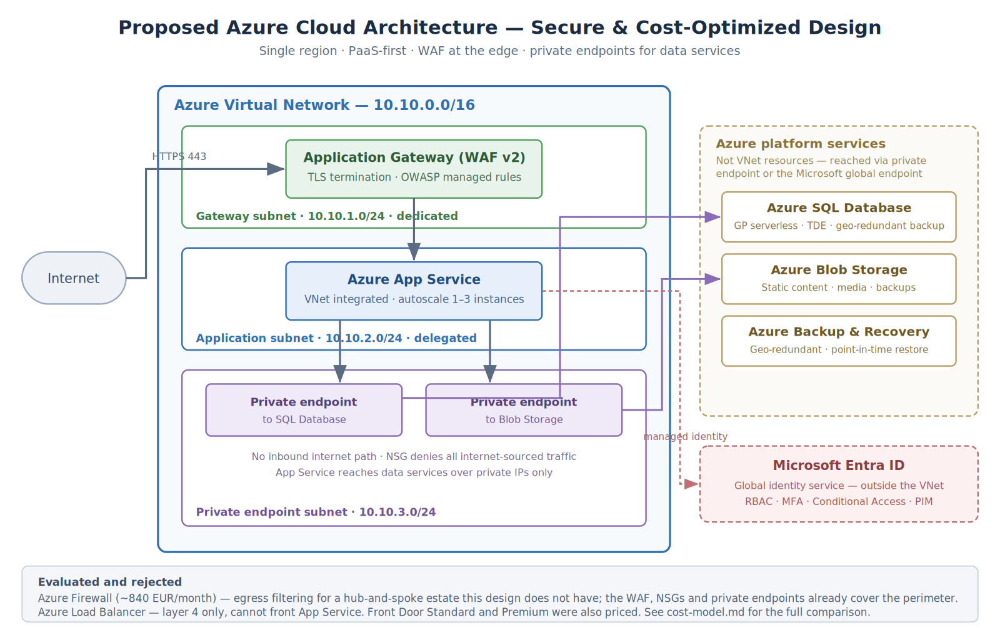

# Secure & Cost-Optimized Azure Cloud Architecture

> A consulting-style cloud architecture project for a mid-size European e-commerce client (~120 employees). Designed for high availability, GDPR compliance, Zero Trust security, and predictable monthly cost — built entirely on Microsoft Azure PaaS services.



---

## Project Overview

This project simulates a real client engagement: a growing e-commerce company needs to migrate to a secure, scalable cloud platform. As the cloud consultant, I gathered business requirements, designed a fit-for-purpose Azure architecture, modelled the monthly cost, and produced executive-level documentation.

**Role:** Cloud Architect / Consultant (solo project)
**Cloud:** Microsoft Azure
**Deliverables:** Architecture diagram, infrastructure-as-code snippet, cost model, executive report, requirements document

---

## Business Context

| Item | Detail |
|------|--------|
| Client profile | Mid-size e-commerce company, 120 employees, expanding across Europe |
| Core business need | Secure, scalable, cost-efficient cloud platform |
| Compliance | GDPR |
| Workload | Customer-facing web application + transactional database |

Full requirements: [`requirements.md`](./requirements.md)

---

## Architecture Summary

The solution is built around an **Azure Virtual Network (VNet)** segmented into public and private subnets. The web tier is fronted by an **Azure Load Balancer** and hosted on **Azure App Service**. Sensitive data lives in a private subnet with **Azure SQL Database** and **Blob Storage**, protected by **Azure Firewall** and **Network Security Groups (NSGs)**. **Microsoft Entra ID** handles identity and access, and **Azure Backup & Recovery Services** provides geo-redundant disaster recovery.

### Core Components

| Layer | Service | Purpose |
|-------|---------|---------|
| Networking | Azure Virtual Network, NSG, Azure Firewall | Network isolation and perimeter security |
| Compute | Azure App Service | Managed PaaS hosting for the web application |
| Traffic distribution | Azure Load Balancer | High availability across instances |
| Data | Azure SQL Database | Transactional store for customer & order data |
| Storage | Azure Blob Storage | Static content, backups, media files |
| Identity | Microsoft Entra ID | RBAC, MFA, least-privilege access |
| Resilience | Azure Backup & Recovery Services | Geo-redundant backups, DR strategy |

Full architecture detail: [`architecture.md`](./architecture.md)

---

## Design Principles

- **Zero Trust security** — every request authenticated and authorized; no implicit network trust
- **Least privilege access** — RBAC roles scoped narrowly, MFA enforced
- **High availability** — load-balanced web tier, geo-redundant backups
- **Cost optimization** — PaaS-first to minimize operational overhead, auto-scaling, reserved instances for predictable workloads
- **Defense in depth** — network segmentation + firewall + NSGs + identity controls + encryption at rest and in transit

---

## Cost Model

Estimated monthly Azure spend for the proposed architecture:

| Resource | Service | Estimated Monthly Cost (EUR) |
|----------|---------|------------------------------|
| Web Application | Azure App Service | 120 |
| Database | Azure SQL Database | 150 |
| Storage | Azure Blob Storage | 40 |
| Networking | VNet, Load Balancer, Firewall | 90 |
| Security & Monitoring | Microsoft Defender for Cloud | 50 |
| Backup & Recovery | Azure Backup Services | 30 |
| **Total** | | **~480 EUR / month** |

Optimization strategies, scaling assumptions and governance: [`cost-model.md`](./cost-model.md)

---

## Infrastructure as Code (Sample)

The networking layer of this design is codified in Bicep — Microsoft's native IaC language for Azure — to demonstrate that the architecture is implementable, not just diagrammed.

📄 [`infra/network.bicep`](./infra/network.bicep) — Defines the VNet, public + private subnets, and an NSG with least-privilege inbound rules.

Validate locally with the Azure CLI:

```bash
az bicep build --file infra/network.bicep
```

---

## Repository Structure

```
.
├── README.md              # This file
├── architecture.png       # Architecture diagram
├── architecture.md        # Detailed architecture documentation
├── requirements.md        # Client business & technical requirements
├── cost-model.md          # Monthly cost breakdown & optimization strategy
├── executive-report.md    # Executive consulting summary
└── infra/
    └── network.bicep      # Infrastructure-as-Code: VNet, subnets, NSG
```

---

## Skills Demonstrated

**Cloud:** Microsoft Azure, Azure Networking, Azure PaaS services, Microsoft Entra ID
**Architecture:** Cloud architecture design, security architecture, cost modelling
**Security:** Zero Trust, Defense in depth, RBAC, MFA, network segmentation, GDPR awareness
**IaC:** Bicep (sample module), Azure CLI
**Consulting:** Requirements gathering, executive reporting, business case writing

---

## Author

**Kumail Janjua** — BSc Computer Science, 
Microsoft Certified: Azure Fundamentals (AZ-900)
